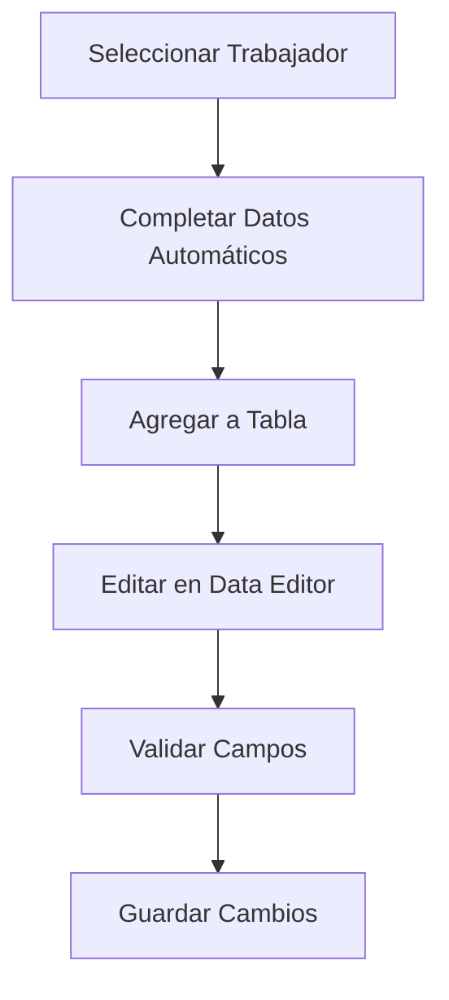
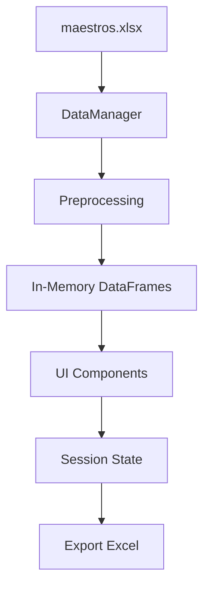

# Guía de la Aplicación de Registro de Incidencias - Streamlit

## 📋 Descripción General

Esta aplicación de Streamlit está diseñada para el registro y gestión de incidencias de personal en diferentes centros de trabajo. Permite a los supervisores registrar eventos como absentismo, refuerzos, eventos especiales, y calcular automáticamente los costes asociados.

### 🎯 Objetivo del Proyecto
- Registrar incidencias de trabajadores asignados a diferentes centros
- Permitir el uso de personal de otros centros para atender incidencias
- Consolidar toda la información en un archivo Excel exportable
- Calcular automáticamente costes y tarifas de nocturnidad

## 🗂️ Estructura de Datos

### Archivos de Entrada
La aplicación utiliza un archivo Excel (`maestros.xlsx`) con las siguientes hojas:

#### 📊 Hoja "trabajadores"
Contiene información completa de los empleados:
- **Datos personales**: código, nombre, DNI, teléfono, email
- **Datos laborales**: empresa, contrato, categoría, departamento
- **Datos económicos**: coste hora empresa, tarifa
- **Asignaciones**: código Crown, centro preferente, jefe de operaciones

#### 🏢 Hoja "centros" 
Información de los centros de trabajo:
- **Identificación**: código y descripción del centro
- **Gestión**: jefe de operaciones asignado
- **Estado**: fechas de alta y baja
- **Relaciones**: centro preferente asociado

#### 💰 Hoja "tarifas_incidencias"
Tarifas para cálculo de nocturnidad:
- **Estructura**: categoría del empleado y código de convenio
- **Tarifa**: precio por hora de nocturnidad

#### 📋 Hoja "cuenta_motivos"
Mapeo de motivos a cuentas contables:
- **Motivos**: Absentismo, Refuerzo, Eventos, etc.
- **Cuentas**: 70/71 (Festivos), 72 (Incentivos), 73 (Sustitución), 74 (Nocturnidad)

#### 🗺️ Hoja "maestro_centros"
Catálogo maestro de centros con información adicional

## 🏗️ Arquitectura de la Aplicación

### 📐 Patrón de Diseño
La aplicación sigue el patrón **MVC (Model-View-Controller)** adaptado:
- **Model**: `DataManager` y `Incidencia`
- **View**: Componentes de Streamlit
- **Controller**: Clases de gestión (`TablaUnificadaIncidencias`, `ExportManager`)

### 🔧 Componentes Principales

#### 1. **Clase `Incidencia`** (Modelo de Datos)
```python
@dataclass
class Incidencia:
    trabajador: str = ""
    motivo: str = ""
    fecha: Optional[datetime] = None
    # ... otros campos
```

**Propósito**: Representa una incidencia individual con todos sus atributos
**Características**:
- Usa `@dataclass` para definición limpia
- Incluye validación con `is_valid()`
- Convierte a diccionario para la interfaz

#### 2. **Clase `DataManager`** (Gestor de Datos)
```python
class DataManager:
    def __init__(self):
        self.maestros = _load_and_preprocess_excel('data/maestros.xlsx')
```

**Responsabilidades**:
- Cargar y preprocesar datos del Excel
- Gestionar relaciones entre empleados y centros
- Calcular tarifas de nocturnidad
- Proporcionar listas filtradas (jefes, empleados)

#### 3. **Clase `TablaUnificadaIncidencias`** (Interfaz Principal)
```python
class TablaUnificadaIncidencias:
    def render(self, selected_jefe: str) -> None:
        # Renderiza la tabla editable
```

**Funcionalidades**:
- Formulario para añadir incidencias
- Tabla editable con `st.data_editor`
- Validación en tiempo real
- Actualización automática de datos

#### 4. **Clase `ExportManager`** (Generador de Reportes)
```python
class ExportManager:
    @staticmethod
    def export_to_excel(incidencias, data_manager) -> bytes:
        # Genera Excel con cálculos adicionales
```

**Características**:
- Aplica cálculos de costes
- Mapea motivos a cuentas contables
- Genera columnas calculadas adicionales

## 🔄 Flujo de la Aplicación

### 1. **Inicialización**
```python
if 'app_initialized_minimalist' not in st.session_state:
    st.session_state.app_initialized_minimalist = True
    st.session_state.selected_jefe = ""
    st.session_state.incidencias = []
```

### 2. **Selección de Parámetros**
- Usuario selecciona imputación de nómina (mes)
- Usuario selecciona supervisor/jefe de operaciones
- Se reinicia la lista de incidencias al cambiar parámetros

### 3. **Registro de Incidencias**


### 4. **Procesamiento de Datos**
- Los datos del empleado se cargan automáticamente
- Se calculan tarifas de nocturnidad dinámicamente
- Se aplican las reglas de negocio

### 5. **Exportación**
- Validación de incidencias completas
- Cálculo de métricas totales
- Generación del Excel con columnas calculadas

## 🛠️ Funciones de Preprocesamiento

### `preprocess_trabajadores()`
```python
def preprocess_trabajadores(df: pd.DataFrame) -> pd.DataFrame:
    # Normalización de columnas
    df.columns = df.columns.str.strip().str.replace('\n', ' ')
    
    # Mapeo de códigos de empresa
    df['cod_empresa'] = np.select([...], ['SMI', 'ALGADI', 'DISTEGSA'])
    
    # Determinación de servicio por categoría
    df['servicio'] = np.where(
        df['cat_empleado'].str.contains('limp|asl', case=False),
        '020 Limpieza', '010 Restauración'
    )
```

**Transformaciones clave**:
- Limpieza de nombres de columnas
- Mapeo de códigos a nombres descriptivos
- Asignación automática de servicios
- Normalización de datos

## 💡 Características Avanzadas

### 🔄 Gestión de Estado
```python
# Streamlit Session State para persistencia
st.session_state.incidencias  # Lista de incidencias
st.session_state.selected_jefe  # Jefe seleccionado
st.session_state.selected_imputacion  # Mes de imputación
```

### 📊 Tabla Editable Avanzada
```python
st.data_editor(
    df,
    column_config={
        "Trabajador": st.column_config.SelectboxColumn(
            options=todos_empleados
        ),
        "Motivo": st.column_config.SelectboxColumn(
            options=["Absentismo", "Refuerzo", ...]
        )
    }
)
```

### 🧮 Cálculos Dinámicos
```python
def get_precio_nocturnidad(self, categoria: str, cod_convenio: str) -> float:
    # Busca en tabla de tarifas por categoría y convenio
    mask = (
        (df_tarifas['Descripción'].str.upper() == categoria.upper()) &
        (df_tarifas['cod_convenio'] == cod_convenio)
    )
    return float(df_tarifas.loc[mask, 'tarifa_noct'].iloc[0])
```

## 📈 Cálculos de Costes

### Fórmulas Implementadas

#### 1. **Coste Total por Incidencia**
```
Coste_total = (incidencia_horas × incidencia_precio + 
               nocturnidad_horas × precio_nocturnidad) × 1.3195 + 
               traslados_total
```

#### 2. **Distribución por Cuentas Contables**
- **73 Plus Sustitución**: Absentismo
- **72 Incentivos**: Refuerzo
- **70/71 Festivos**: Eventos y festivos
- **74 Plus Nocturnidad**: Nocturnidad × tarifa

#### 3. **Factor de Seguridad Social**
El factor `1.3195` incluye cargas sociales de la empresa

## 🔧 Configuración y Despliegue

### Dependencias
```python
import streamlit as st
import pandas as pd
import numpy as np
from datetime import datetime
import io
from typing import List, Dict, Optional
from dataclasses import dataclass, field
```

### Estructura de Directorios
```
proyecto/
├── app.py                 # Aplicación principal
├── data/
│   └── maestros.xlsx     # Archivo de datos maestros
└── requirements.txt      # Dependencias Python
```

### Configuración de Página
```python
st.set_page_config(
    page_title="Registro de Incidencias",
    page_icon="📋",
    layout="wide"
)
```

## 🚀 Ejecución de la Aplicación

### Comando de Inicio
```bash
streamlit run app.py
```

### URL de Acceso
```
http://localhost:8501
```

## 🔍 Funcionalidades Clave para Desarrolladores

### 1. **Validación de Datos**
```python
def is_valid(self) -> bool:
    required_fields = [
        self.trabajador, self.imputacion_nomina, 
        self.facturable, self.motivo, 
        self.codigo_crown_destino, self.fecha, 
        self.observaciones
    ]
    return all(field is not None and field != "" for field in required_fields)
```

### 2. **Actualización Dinámica**
- Uso de `st.rerun()` para refrescar la interfaz
- Manejo de eventos de cambio en selectboxes
- Persistencia de datos en session state

### 3. **Exportación Optimizada**
```python
@st.cache_data
def _load_and_preprocess_excel(file_path: str) -> Dict[str, pd.DataFrame]:
    # Caché para optimizar carga de datos
```

## 🎯 Mejores Prácticas Implementadas

### 1. **Separación de Responsabilidades**
- Cada clase tiene una responsabilidad específica
- Funciones de preprocesamiento separadas por tipo de datos

### 2. **Gestión de Errores**
```python
try:
    # Operación que puede fallar
    df = pd.read_excel(file_path)
except FileNotFoundError:
    st.error(f"Error: El archivo '{file_path}' no se encuentra.")
    return {}
```

### 3. **Optimización de Performance**
- Uso de `@st.cache_data` para datos que no cambian
- Carga lazy de datos pesados
- Validación eficiente de formularios

### 4. **UX/UI Consideraciones**
- Mensajes informativos claros
- Validación en tiempo real
- Interfaz responsive con columnas

## 🔮 Extensiones Futuras

### Funcionalidades Sugeridas
1. **Autenticación de usuarios**
2. **Base de datos externa** (PostgreSQL/MySQL)
3. **Notificaciones por email**
4. **Dashboard analítico**
5. **API REST** para integración
6. **Modo offline** con sincronización

### Optimizaciones Técnicas
1. **Lazy loading** de datos grandes
2. **Paginación** en tablas extensas
3. **Compresión** de archivos Excel
4. **Logs** de auditoría
5. **Tests automatizados**

## 📚 Recursos Adicionales

### Documentación Relevante
- [Streamlit Documentation](https://docs.streamlit.io/)
- [Pandas User Guide](https://pandas.pydata.org/docs/user_guide/)
- [Python Dataclasses](https://docs.python.org/3/library/dataclasses.html)

### Patrones de Diseño Aplicados
- **Factory Pattern**: En preprocesadores
- **Observer Pattern**: En session state
- **Strategy Pattern**: En cálculos de tarifas

# 📋 RESUMEN TÉCNICO EJECUTIVO

## 🔧 Stack Tecnológico
- **Frontend**: Streamlit 
- **Backend**: Python 3.8+
- **Procesamiento de Datos**: Pandas, NumPy
- **Almacenamiento**: Excel (XLSX) como base de datos
- **Arquitectura**: Monolítica con separación por capas

## 🏗️ Arquitectura del Sistema
```
┌─────────────────────────────────────────────────────────┐
│                 STREAMLIT UI LAYER                      │
├─────────────────────────────────────────────────────────┤
│  TablaUnificadaIncidencias  │  ExportManager            │
├─────────────────────────────────────────────────────────┤
│                 BUSINESS LOGIC LAYER                    │
├─────────────────────────────────────────────────────────┤
│           DataManager        │    Incidencia (Model)    │
├─────────────────────────────────────────────────────────┤
│                   DATA ACCESS LAYER                     │
├─────────────────────────────────────────────────────────┤
│  Excel Reader/Writer  │  Preprocessing Functions       │
└─────────────────────────────────────────────────────────┘
```

## 📊 Modelo de Datos

### Entidades Principales
| Entidad | Campos Clave | Relaciones |
|---------|--------------|------------|
| `Incidencia` | trabajador, fecha, motivo, horas | → Trabajador |
| `Trabajador` | nombre, categoria, centro_pref | → Centro |
| `Centro` | codigo, nombre, jefe_ope | → Jefe |
| `Tarifa` | categoria, convenio, precio_noct | → Trabajador |

### Flujo de Datos


## 🚀 Performance y Escalabilidad

### Optimizaciones Implementadas
- **Caching**: `@st.cache_data` para carga de Excel
- **Lazy Loading**: Datos se cargan una vez por sesión
- **Memory Management**: DataFrames optimizados con tipos específicos
- **UI Responsivo**: Columnas adaptativas y paginación implícita

### Limitaciones Actuales
- **Concurrencia**: Sin soporte multi-usuario simultáneo
- **Volumen**: Limitado por memoria RAM (~10K registros)
- **Persistencia**: Sin base de datos transaccional
- **Backup**: Dependiente de archivos locales

## 🔐 Seguridad y Validación

### Validaciones de Datos
```python
# Validación de campos obligatorios
required_fields = [trabajador, motivo, fecha, crown_destino]

# Validación de tipos de datos
incidencia_horas: float (≥ 0)
fecha: datetime (formato válido)

# Validación de integridad referencial
codigo_crown_destino ∈ {centros_validos}
trabajador ∈ {empleados_activos}
```

### Control de Acceso
- **Nivel aplicación**: Filtrado por jefe seleccionado
- **Nivel datos**: Validación de permisos implícita
- **Sin autenticación**: Sistema de confianza

## 📈 Métricas y KPIs

### Cálculos Automáticos
| Métrica | Fórmula | Propósito |
|---------|---------|-----------|
| **Coste Total** | `(inc_horas × precio + noct_horas × tarifa_noct) × 1.3195 + traslados` | Coste real empresa |
| **Plus Nocturnidad** | `nocturnidad_horas × get_precio_nocturnidad()` | Coste adicional nocturno |
| **Distribución Contable** | Mapeo motivo → cuenta (70/71/72/73/74) | Imputación contable |

### Indicadores de Negocio
- **Total Incidencias**: Suma de costes directos
- **Total Nocturnidad**: Suma de plus nocturnos
- **Total Traslados**: Costes de desplazamiento
- **Coste Final**: Con cargas sociales incluidas

## 🔄 Flujo de Procesamiento

### 1. Inicialización del Sistema
```python
DataManager.__init__()
├── Carga maestros.xlsx
├── Preprocessing por hoja
├── Merge de relaciones
└── Cache en session_state
```

### 2. Ciclo de Interacción Usuario
```python
render_ui()
├── Selección jefe/imputación
├── Reset incidencias
├── Loop: añadir/editar incidencias
└── Validación continua
```

### 3. Procesamiento de Exportación
```python
export_to_excel()
├── Filtrado incidencias válidas
├── Cálculo columnas derivadas
├── Mapeo cuentas contables
└── Generación Excel binario
```

## 🛠️ APIs y Interfaces

### Métodos Públicos Principales
```python
class DataManager:
    get_jefes() -> List[str]                    # Lista supervisores
    get_all_employees() -> List[str]            # Lista empleados
    get_empleado_info(nombre) -> Dict           # Info empleado
    get_precio_nocturnidad(cat, conv) -> float  # Tarifa nocturnidad

class Incidencia:
    is_valid() -> bool                          # Validación completa
    to_dict() -> Dict                          # Serialización UI

class ExportManager:
    export_to_excel() -> bytes                 # Generación reporte
```

### Estados de Session
```python
st.session_state = {
    'app_initialized_minimalist': bool,
    'selected_jefe': str,
    'selected_imputacion': str,
    'incidencias': List[Incidencia]
}
```

## ⚡ Deployment y DevOps

### Requisitos del Sistema
- **Python**: 3.8+
- **RAM**: Mínimo 512MB, recomendado 2GB
- **Storage**: 100MB para aplicación + datos
- **CPU**: Single-core suficiente para <100 usuarios/día

### Configuración de Producción
```python
# Streamlit config
st.set_page_config(layout="wide", page_title="Incidencias")

# Performance settings
@st.cache_data(ttl=3600)  # Cache 1 hora
def load_data(): pass

# Error handling
try/except con st.error() para UX
```

### Monitoreo Sugerido
- **Logs**: Streamlit access logs
- **Métricas**: Session duration, export frequency
- **Errores**: Excel corruption, validation failures
- **Performance**: Load times, memory usage

## 🔮 Roadmap Técnico

### Corto Plazo (1-3 meses)
- [ ] **Database Migration**: SQLite → PostgreSQL
- [ ] **User Auth**: Login básico con roles
- [ ] **API REST**: Endpoints para CRUD incidencias
- [ ] **Unit Tests**: Coverage >80%

### Medio Plazo (3-6 meses)
- [ ] **Multi-tenancy**: Soporte múltiples empresas
- [ ] **Real-time**: WebSocket updates
- [ ] **Analytics Dashboard**: Métricas avanzadas
- [ ] **Mobile Support**: Responsive design

### Largo Plazo (6+ meses)
- [ ] **Microservices**: Separación por dominios
- [ ] **Cloud Native**: Kubernetes deployment
- [ ] **AI/ML**: Predicción de incidencias
- [ ] **Integration Hub**: ERP/HRIS connectors

---

## 🤝 Contribución

Para desarrolladores que quieran contribuir:

1. **Fork** el repositorio
2. **Crear branch** para la funcionalidad
3. **Implementar** con tests
4. **Pull request** con descripción detallada

## 📧 Contacto

Para dudas técnicas sobre esta implementación, consultar la documentación interna o crear un issue en el repositorio del proyecto.